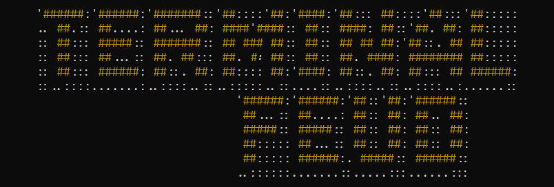
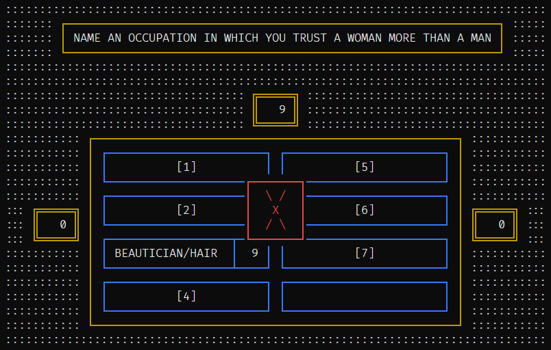
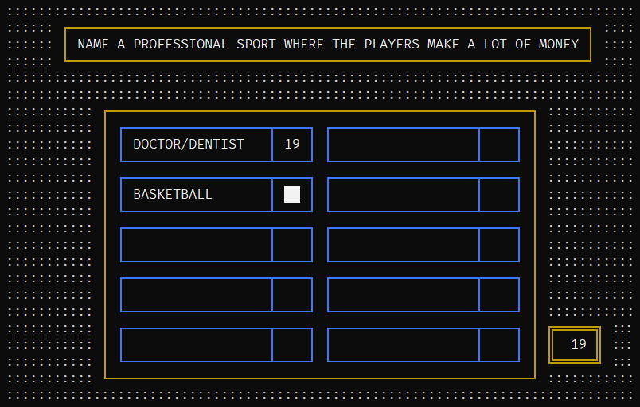

## About Terminal Feud

I recently watched [terminal feud](https://www.youtube.com/watch?v=fMy0XhFdLAE) on [ThePrimeTime's](https://www.youtube.com/@ThePrimeTimeagen) channel and while I had fun watching it, I was disappointed that their version of terminal feud was not actually run in a terminal. This is my attempt to remedy that. I've created a CLI version of the popular game show, Family Feud. To be clear, this is an interface to control the game board for a real life event. It can't be played online with other people or in single player mode. It's designed to be used at a work party/event or similar. An in-person host and in-person players are required, in addition to someone who will control the board through this app.

## Requirements

The blessed and PyYAML modules are required. They can be installed by running: `pip install blessed pyyaml`

## Usage

Here's how a typical game can be played.

- Start by editing the game.yaml file. The file should be self explanatory, but you will need to add your own questions and scores.
- Save the game data file and launch the application by running `python feud.py`. This should be output to a large screen or projector for the audience to see.
- The game will start on the title screen. Wait here for the host to do the introductions and then call up two people to the buzzers.

 

### Rounds 1-3
- Press `r` to advance to the first round title screen and wait here until the first question has been read by the host. The questions is visible on the next screen so you should not show it until the question has been heard by the players.
- After the question has been read, press `r` to display the round game screen.
- Players will make their guesses. If the guess is correct, press the corresponding number (`1` through `8`) that matches the correct answer from the game data file. This will display the answer on the board. It would be helpful to have the game data file open on a separate screen (a screen not visible to the players) to use as reference.
- If a guess is incorrect, you can press `x` to show an X on the screen and increase the X count. The next time `x` is pressed, it will show two Xs on the board and then three the next time. You can decrease the X count if needed by pressing `X`.
- Repeat the above steps until all answers have been guessed or there have been three wrong guesses. Then press either `a` or `b` to indicate whether team A (left team) or team B (right team) has won the points for this round. The score board will reflect the updated scores.
- Press `9` to display the answers that have not been guessed yet. There is a small pause between each answer to give the audience time to read them out loud.
- Press `r` to move to the title screen for the next round. You can also press `R` to go through the round screens in reverse order if needed.
- Repeat the above steps for rounds 2 and 3.

 

### Fast Money Round
- The fast money round is the final round and is a little different. The host will ask five questions to player 1 and you will need to record the player's guesses in the game data file under the guesses section for round 4. Replace the placeholder text with the guess provided for each question. The guess can be a max of 16 characters, but you don't need to worry about that because the game will truncate the guesses if needed, and will also convert them to uppercase.
- After the questions have all been guessed, quickly reference the questions and answers in the game data file to see if there are any matches and update the score for each correct guess, or leave it as 0 for an incorrect guess.
- Save the file and press `l` (lower case L) to reload the game data, which will import player 1s answers and scores.
- Press `f` repeatedly to cycle through the steps, following the pace of the host.
    - The first `f` will show the question and should be pressed as the host starts reading the question.
    - The next `f` will show the guess provided by the player (just the guess, not the score yet).
    - The third `f` will show the score.
    - Repeat these steps for each of the five questions.
- After the questions are complete, press `m` to hide player 1's guesses so that player 2 won't see them as they come out to the stage.
- After player 2 comes out, you can press `m` again if the player is facing away from the screen (this is for the audience to see the previous guesses), or you can leave the guesses hidden until player 2 is done with their guesses.
- When player 2 is done guessing, press `m` (if the answers are still hidden), then press `f` to cycle through the steps, same as you did for player 1.
- That's it. The game is over at this point. You can press 'q' to quit the game.

 

> [!TIP]
> Increase your terminal font size until the game board fills the entire screen.

> [!TIP]
> Make sure capslock is off.

> [!TIP]
> Do a few test runs of your game file before the actual event.

## Controls

| Key        | Description                                                   |
| ---------- | ------------------------------------------------------------- |
| `r` / `R`  | move forward / backwards through the round screens            |
| `1` to `8` | toggle the visibility of the corresponding answer             |
| `9`        | display the remaining answers that have not been guessed yet  |
| `0`        | hide all the answers; this will reset the current round       |
| `x` / `X`  | show x / decrease x count                                     |
| `a` / `b`  | toggle team a / b as the winner of the round                  |
| `f` / `F`  | step forwards / backwards through the fast money steps        |
| `m`        | toggle the visibility of the fast money guesses               |
| `l`        | load/reload game data                                         |
| `q`        | quit                                                          |

## Todo

- [ ] create a separate admin app to control the board from a different terminal (this will prevent having to reference/modify the game data file during the game).
- [ ] create a config file to allow customizing, the colors, key bindings, screen size, etc.
- [ ] add an option to specify the game data file from the command line.
- [ ] add an option to restart an in-progress game in case a game is interrupted or terminated unexpectedly.

## License

This project is open-sourced software licensed under the [GNU GPLv3 license](LICENSE).
